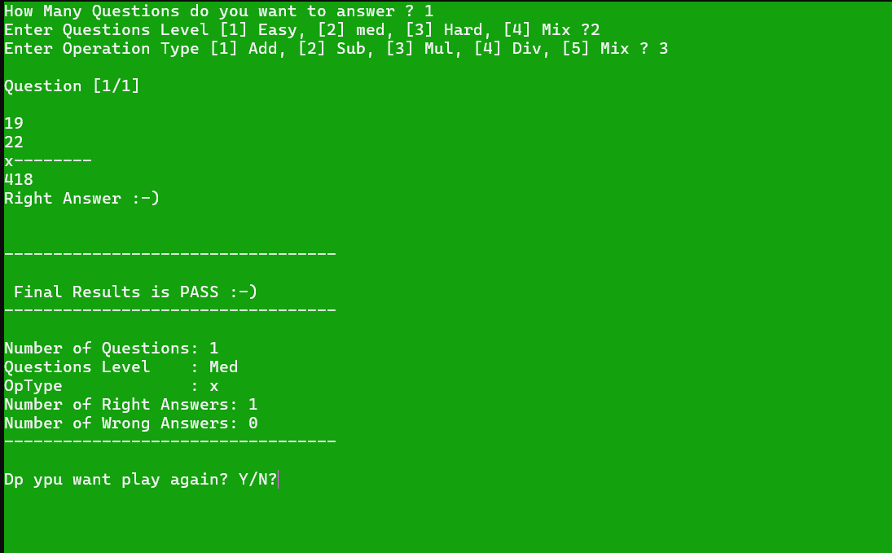

# CPP_Math_Game 🧮🎯🖥️

## Overview 🎯📌🔍
**CPP_Math_Game** is an interactive C++ console application where players solve randomly generated math problems.  
It offers different levels of difficulty, various operation types, and immediate feedback for every answer, all while practicing modular, clean coding principles. 🎉

<br>

## Features 🚀🔥🧩
- Choose the number of questions (1-10)
- Select difficulty level (Easy, Medium, Hard, or Mixed)
- Choose operations (Addition, Subtraction, Multiplication, Division, Mixed)
- Randomly generated math problems each round
- Instant feedback with color and sound effects 🎵
- Pass/Fail results summary after completing the game

<br>

## Table of Contents 📖📝🔍
1. [Installation](#installation)
2. [How to Play](#how-to-play)
3. [Project Structure](#project-structure)
4. [Code Breakdown](#code-breakdown)
5. [Best Practices](#best-practices)
6. [Future Improvements](#future-improvements)
7. [License](#license)

<br>

## Installation 🛠️📂🔧
To run this program on your system:
1. Make sure you have **Visual Studio** with C++ installed (or any C++ compiler).
2. Clone the repository:
   ```bash
   git clone https://github.com/AbdulKanawati/CPP_Math_Game.git
   ```
3. Open `CPP_Math_Game.sln` in Visual Studio.
4. Build and run the project.

   > The game uses `system("cls")` and `system("color")` commands, so it's intended for Windows systems. 🪟

<br>

## How to Play 🎮🕹️🧮
- At the start, the player selects:
  - Number of questions
  - Difficulty level
  - Type of operation
- Answer the randomly generated math questions.
- Instant feedback is provided after each answer.
- After finishing all questions, a summary shows your score and pass/fail status! 🎉

<br>

## Project Structure 🏗️📂📜
```
CPP_Math_Game/
│
├── .gitattributes
├── .gitignore
├── CPP_Math_Game.cpp         # Main source code
├── CPP_Math_Game.sln         # Visual Studio solution
├── CPP_Math_Game.vcxproj     # Visual Studio project file
├── CPP_Math_Game.vcxproj.filters
├── Screenshot_CPP_Math_Game.png # Game screenshot
└── README.md                 # Project description
```

📸 Example Screenshot:



<br>

## Code Breakdown 🧐📜💻

### Importing Libraries 📚🔗🛠️
```cpp
#include <iostream>
#include <cstdlib>
#include <ctime>
using namespace std;
```
- **iostream**: For input/output operations
- **cstdlib**: For system functions and random number generation
- **ctime**: To seed the random number generator

<br>

### Structs and Enums 🏗️🔢🎲
- Organized game data (questions, answers, scores) into clean structures
- Enums are used for difficulty levels and operations 🎯

<br>

### Game Logic 🔄🎮🧠
- Random number generation based on difficulty
- Operation type decides the question format
- Instant evaluation and feedback
- Modular function-based approach to manage different game components

<br>

## Best Practices ✅🛠️💡
- **Modular Programming** (small functions with clear responsibilities)
- **Separation of Concerns** (UI, logic, validation separated)
- **Enums and Structs** to improve readability and maintainability
- **Randomization** to create unique math challenges every time
- **Clean Console UI** with colored text for better user experience

<br>

## License 📜⚖️✅
This project is licensed under the MIT License. 🎉
